<div align="center">

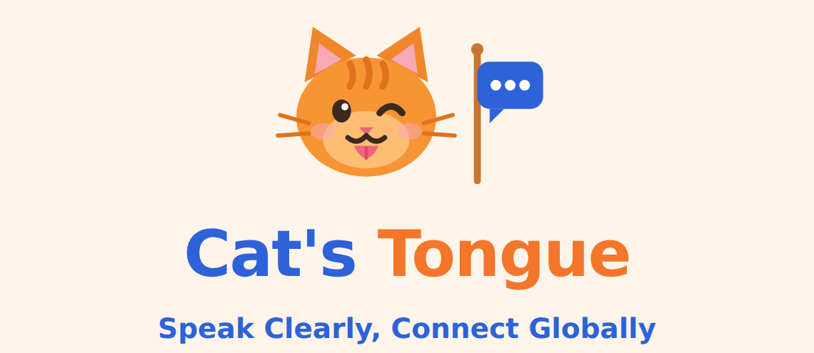

**Learn the words your day actually needs — then say them out loud.**

Tell the app what you're doing today; it packs the exact vocabulary for it.
Then practise speaking with **FRED**, an AI coach who scores your pronunciation,
grammar and fluency.

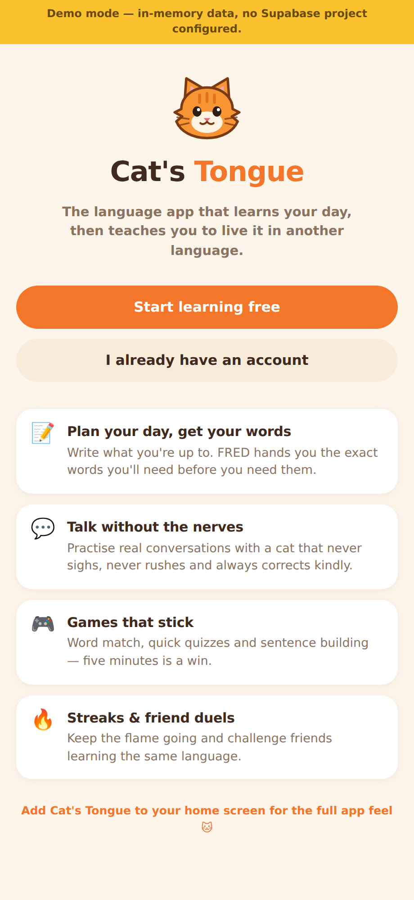
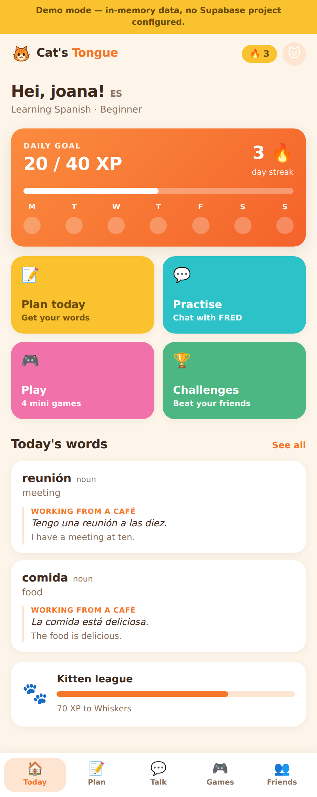
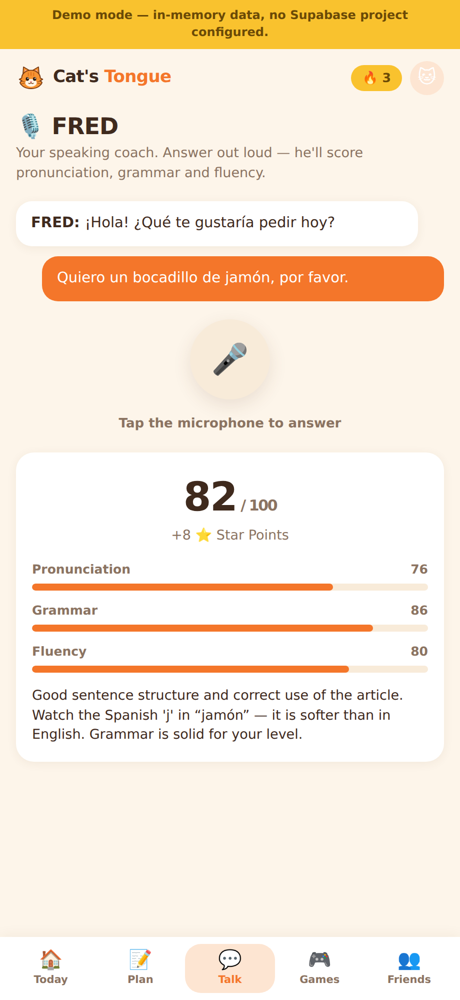

React · TypeScript · Supabase (Postgres + Auth + Storage + Edge Functions) · Capacitor

</div>

---

## What it does

| | Feature |
|---|---------|
| 📝 | **Plan your day** — describe an activity in plain language, get vocabulary tuned to your level |
| 📚 | **One card per word** — a word you already know gains a *new sentence* for the new situation instead of a duplicate |
| 🎙️ | **FRED** — record your answer, get a transcript, coaching feedback and a score |
| 🎮 | **Four mini-games** — Word Match, Quick Quiz, Echo Cat, Sentence Builder, all built from *your* words |
| 🔥 | **Streaks & XP leagues** — Kitten → Whiskers → Prowler → Panther → Legend |
| 👥 | **Friends** — search by username, compare streaks, climb the leaderboard |
| 🏆 | **Challenges** — race a friend through FRED speaking sprints |

**22 languages, any pairing.** Portuguese speaker learning French, Japanese
speaker learning Spanish, English speaker learning Greek — the same list feeds
both "I speak" and "I'm learning". The only rule is that the two differ.

---

## The screens

<table>
<tr>
<td align="center" width="33%"><br><sub><b>Welcome</b><br>What the app does, then the two ways in</sub></td>
<td align="center" width="33%">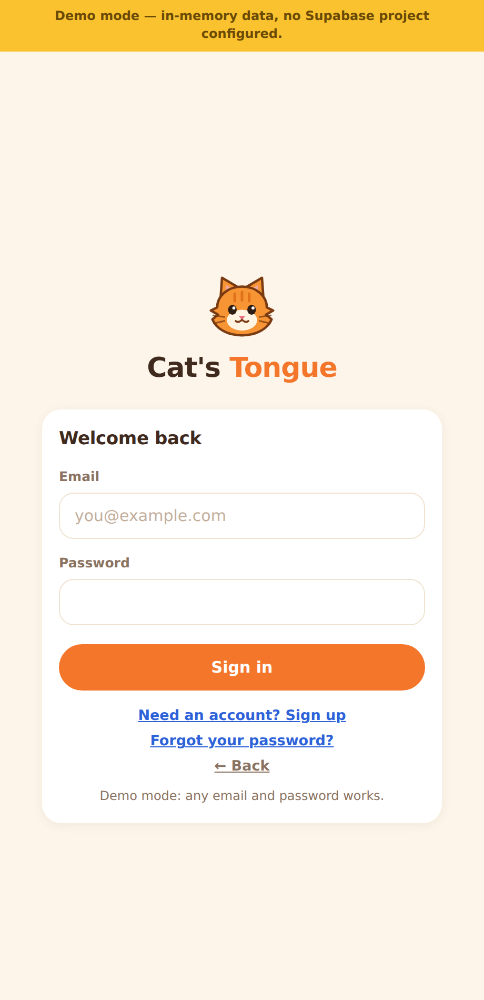<br><sub><b>Sign in</b><br>Generic errors — no account enumeration</sub></td>
<td align="center" width="33%">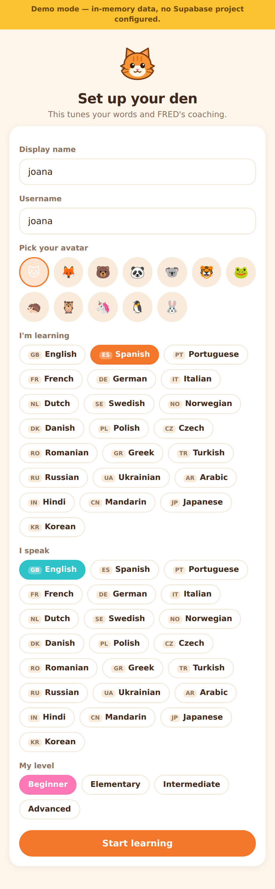<br><sub><b>Set up your den</b><br>Avatar, languages, level</sub></td>
</tr>
<tr>
<td align="center"><br><sub><b>Today</b><br>Daily goal, streak, quick actions</sub></td>
<td align="center">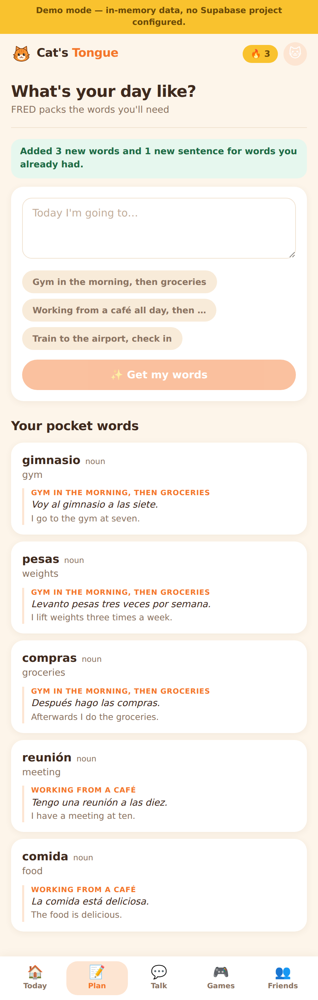<br><sub><b>Plan</b><br>Describe your day, get words</sub></td>
<td align="center">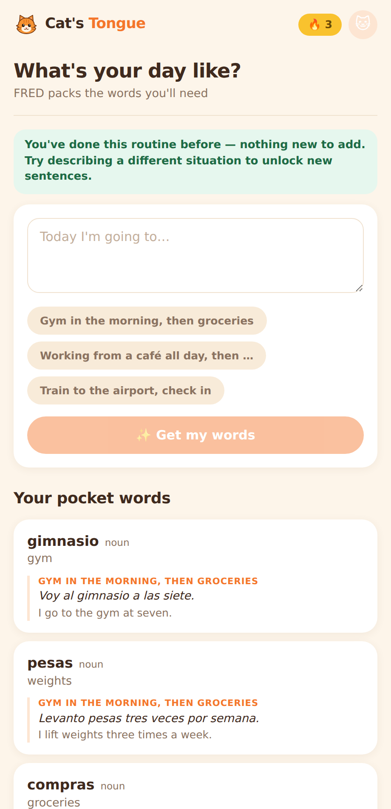<br><sub><b>Repeat a routine</b><br>Adds nothing, and says so</sub></td>
</tr>
<tr>
<td align="center">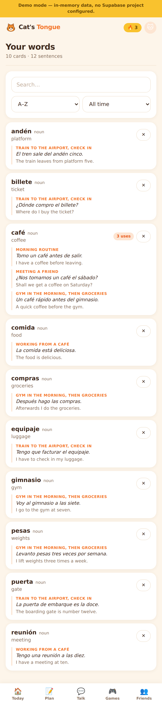<br><sub><b>Your words</b><br>One card, many contexts</sub></td>
<td align="center"><br><sub><b>FRED</b><br>Score + coaching feedback</sub></td>
<td align="center">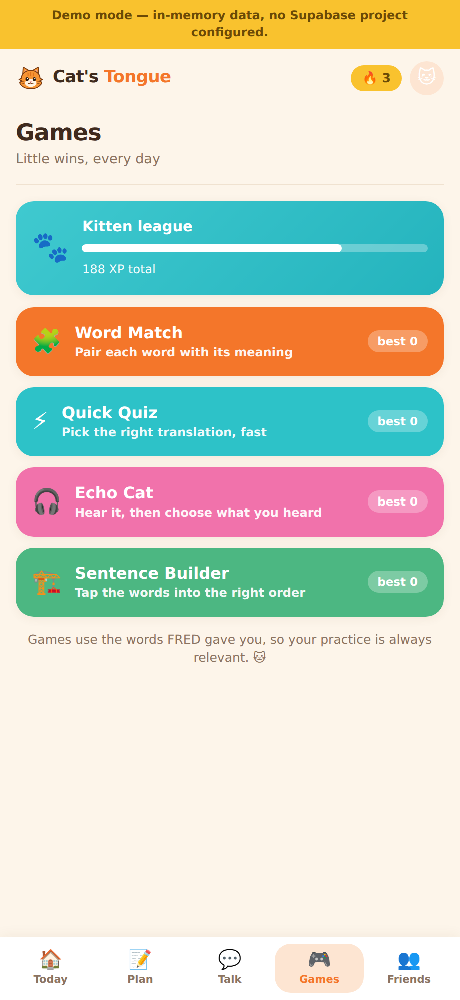<br><sub><b>Games</b><br>Built from your vocabulary</sub></td>
<td align="center">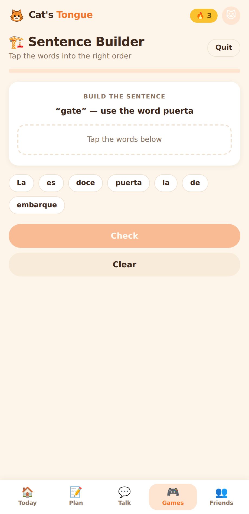<br><sub><b>Sentence Builder</b><br>Tap words into order</sub></td>
</tr>
<tr>
<td align="center">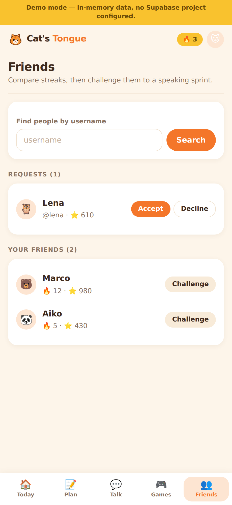<br><sub><b>Friends</b><br>Search, requests, streaks</sub></td>
<td align="center">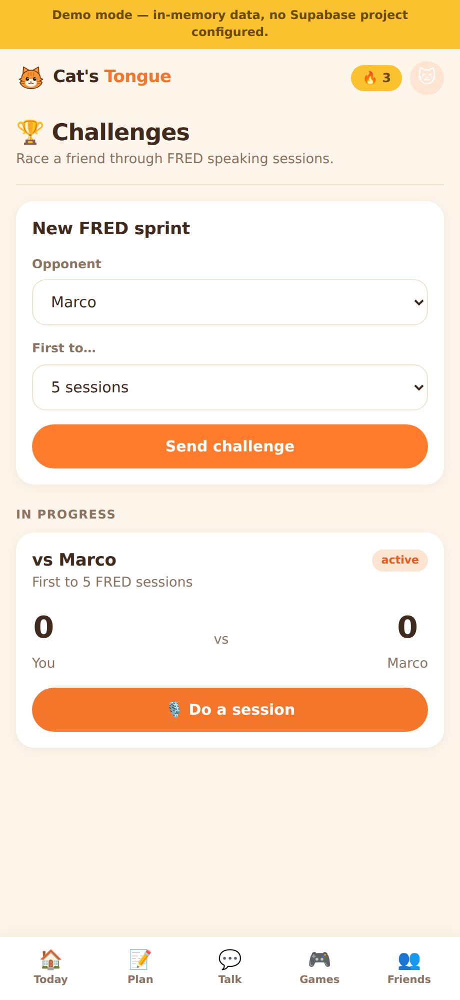<br><sub><b>Challenges</b><br>FRED sprints, scored server-side</sub></td>
<td align="center">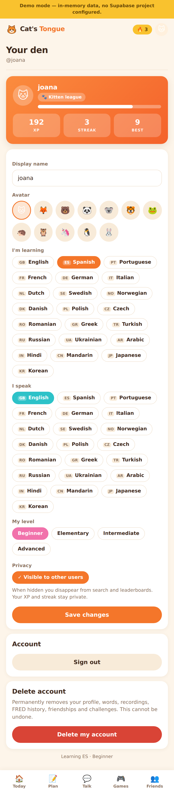<br><sub><b>Your den</b><br>Profile, privacy, deletion</sub></td>
</tr>
</table>

<details>
<summary><b>Account lifecycle</b> — sign-up, confirmation, password reset</summary>
<br>
<table>
<tr>
<td align="center" width="25%">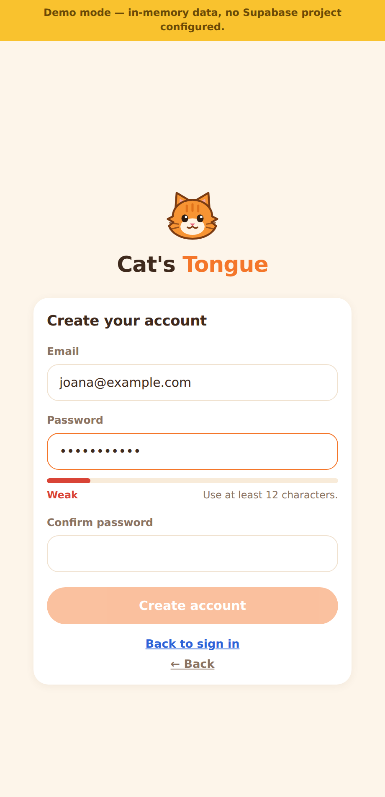<br><sub>Weak password blocked</sub></td>
<td align="center" width="25%">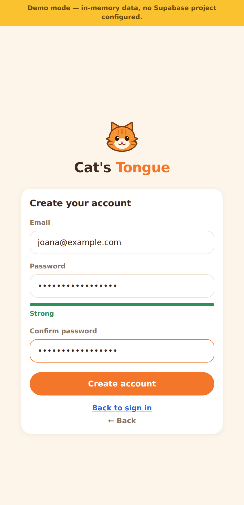<br><sub>Strong password accepted</sub></td>
<td align="center" width="25%"><br><sub>Email confirmation gate</sub></td>
<td align="center" width="25%">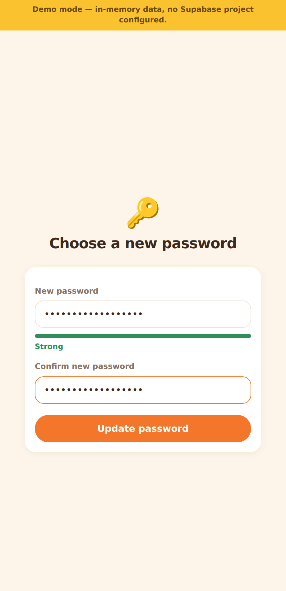<br><sub>Password reset</sub></td>
</tr>
</table>
</details>

<details>
<summary><b>Any language pairing</b></summary>
<br>
<table>
<tr>
<td align="center" width="50%">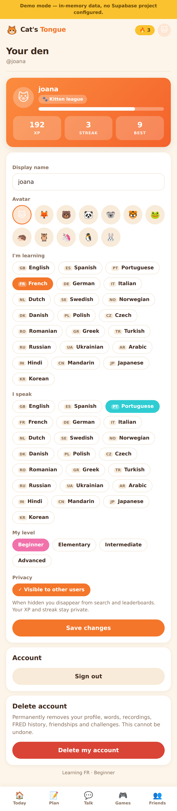<br><sub>Portuguese speaker learning French</sub></td>
<td align="center" width="50%">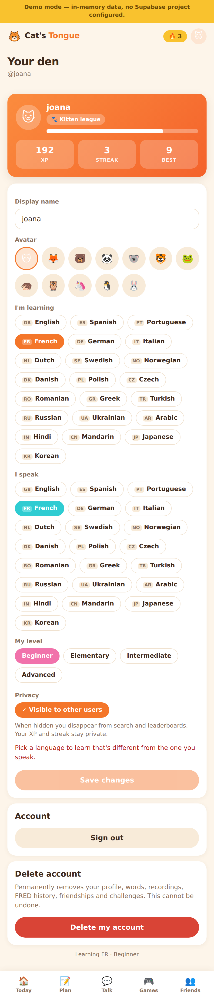<br><sub>Can't "learn" what you already speak</sub></td>
</tr>
</table>
</details>

---

## Try it in 30 seconds

No backend, no account, no configuration:

```bash
cd app
npm install
npm run dev          # → http://localhost:5173
```

Without a `.env` the app runs in **demo mode** against an in-memory store, so
every screen works offline. Sign up with any email, click *Simulate
confirmation*, and explore.

---

## How it's built

```
app/                  React + TypeScript + Vite
  src/pages/          one file per screen (WelcomePage is the signed-out landing)
  src/lib/            api (single data-access layer), session, password policy
  src/components/     CatLogo.tsx — the brand mark, drawn in SVG
  public/favicon.svg  same mark, also the source for the app icons
  scripts/e2e.cjs     30-check end-to-end pass
  scripts/screens.cjs      captures every screen into docs/screens/
  scripts/make-icons.cjs   renders favicon.svg into the Android launcher icons
  android/            Capacitor project (CI turns this into an APK)

supabase/
  migrations/         schema · RLS · functions · storage · auth lifecycle
  functions/          fred-turn, generate-vocabulary, award-game-points,
                      delete-account, purge-unconfirmed

docs/                 architecture, schema, security, pentest, auth, screens
```

The client holds no secrets and never writes its own score. Every AI call and
every point goes through an Edge Function that authenticates the caller,
enforces a per-user daily quota, and writes the result through database
functions the client has no permission to execute.

| Doc | What's in it |
|-----|--------------|
| [ARCHITECTURE.md](docs/ARCHITECTURE.md) | System diagram, the FRED loop, cost control |
| [DATABASE_SCHEMA.md](docs/DATABASE_SCHEMA.md) | Tables, indexes, functions and the reasoning |
| [SECURITY.md](docs/SECURITY.md) | Threat model and mitigations |
| [PENTEST.md](docs/PENTEST.md) | Adversarial review — 4 findings, fixed |
| [AUTH.md](docs/AUTH.md) | Sign-up, confirmation, 24-hour purge, reset, deletion |
| [SCREENS.md](docs/SCREENS.md) | All 33 screens, captured from the running app |

---

## Sharing one Supabase project

Everything lives in a dedicated **`cats_tongue` schema**, so this can sit
alongside other apps in the same Supabase project without disturbing them:

- nothing is created in, altered in, or revoked from `public`;
- no extensions are installed;
- **no trigger on `auth.users`** — profiles are provisioned lazily, so other
  apps' signups are unaffected;
- storage buckets and policies are prefixed `cats-tongue-`;
- the unconfirmed-signup purge only ever deletes accounts tagged as ours.

`drop schema cats_tongue cascade` removes the app entirely and leaves the rest
of the project intact.

---

## Running against a real backend

```bash
cp app/.env.example app/.env       # fill in your project URL + anon key
supabase db push                   # creates the cats_tongue schema only
supabase functions deploy fred-turn generate-vocabulary award-game-points delete-account
supabase functions deploy purge-unconfirmed --no-verify-jwt
```

Then, in the Supabase dashboard:

1. **Settings → API → Exposed schemas** — add `cats_tongue`.
2. **Edge Function secrets** — set the AI provider key, the allowed origins and
   the purge secret.
3. **Auth** — enable email confirmation, a 12-character minimum and
   leaked-password protection. Full list in [AUTH.md §6](docs/AUTH.md).

> **Configuration lives outside this repository.** Only `app/.env.example` is
> committed, and it contains placeholders. The `VITE_`-prefixed values are
> bundled into the client and are public by design — Row Level Security is what
> protects the data. Service-role keys and AI provider keys belong in Edge
> Function secrets and must never be given a `VITE_` name.

---

## Android APK

The web app is wrapped with Capacitor and built by CI:

**Actions → Build Android APK → Run workflow** → download the `cats-tongue-apk`
artifact.

The launcher icon is generated from `public/favicon.svg`; re-run
`node scripts/make-icons.cjs` if the mark ever changes.

Locally, with the Android SDK installed:

```bash
cd app && npm run build && npx cap sync android
cd android && ./gradlew assembleDebug
# → app/android/app/build/outputs/apk/debug/app-debug.apk
```

---

## Tests

```bash
cd app && npm run dev
node scripts/e2e.cjs     # 30 checks: signup → daily use → reset → delete
```

Covers password-policy enforcement, the confirmation gate, repeated-routine
de-duplication, FRED scoring, the mini-games, the social graph and password
recovery.

---

## Status

Working and demoable end-to-end in the browser. The Supabase migrations and
Edge Functions are written and reviewed but have not yet been run against a
live project — that is the next step, along with the dashboard settings above.
