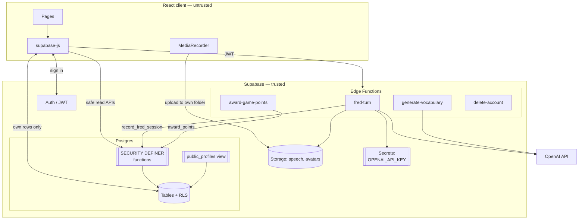

# Architecture — Language Learning App (MVP)

Stack: **Supabase** (Postgres + Auth + Storage + Edge Functions) with a
**React + TypeScript** client. Scope is core functionality, architecture and
security; visual design is deliberately restrained.

## 1. Components

| Layer | Technology | Responsibility |
|-------|-----------|----------------|
| Client | React 18 + TypeScript + Vite | UI, audio capture, RLS-scoped reads. **Holds no secrets.** |
| Auth | Supabase Auth (GoTrue) | Email/password identity, JWTs, `auth.uid()`. |
| Database | Postgres + Row Level Security | All structured data; isolation and game rules enforced here. |
| Storage | Supabase Storage | Speech recordings (private), avatars. |
| Server logic | Edge Functions (Deno) | The only code that holds the AI key or writes scores. |
| AI | OpenAI (GPT-4o + transcription) | Transcription, coaching feedback, vocabulary generation. |

## 2. System diagram



**Principle:** the client reads and writes its *own* ordinary data straight
through RLS — fast and cheap. Anything that spends money or affects ranking
goes through an Edge Function and a SECURITY DEFINER function.

## 3. FRED — the speaking loop

```mermaid
sequenceDiagram
    participant C as Client
    participant S as Storage
    participant F as fred-turn
    participant AI as OpenAI
    participant DB as Postgres

    C->>S: upload speech/<uid>/<id>.webm (storage RLS: own folder)
    C->>F: POST { audioPath, prompt, challengeId } + JWT
    F->>F: verify JWT → uid; reject path outside uid/
    F->>DB: consume_daily_quota(uid)   ← spend guard
    F->>S: download audio (service role)
    F->>AI: transcribe → text
    F->>AI: GPT-4o → feedback, score, next prompt
    F->>DB: record_fred_session(...)  ← session + points + streak + challenge
    F->>S: delete raw audio
    F-->>C: transcript, analysis, score, nextPrompt
    C->>DB: read fred_sessions (RLS: owner only)
```

### Why the AI call cannot live in the client
A shipped bundle is fully readable, so an embedded key is a published key. The
Edge Function is the trust boundary: it verifies the JWT, enforces the quota,
holds the secret, fixes the system prompt, and writes the authoritative result.
The same pattern serves `generate-vocabulary`.

### Cost control
- Per-user **daily quota**, checked and incremented atomically in Postgres.
- Server-fixed `max_tokens`; learner input length-clipped before the call.
- `tokens_used` recorded per session and per day in `usage_daily`.
- Raw audio deleted immediately after transcription.
- OpenAI account spend cap as the final backstop.

## 4. Where authorisation lives

| Concern | Enforced by |
|---------|-------------|
| "Can I see this row?" | RLS policy on the table |
| "Can I see this *column* of someone else's row?" | `public_profiles` view (explicit column list) |
| "Can I change this column?" | RLS `with check` + column-freeze triggers |
| "Can I earn these points?" | `award_points()` — no client EXECUTE grant |
| "Can I afford this AI call?" | `consume_daily_quota()` |
| "Is this really me?" | `getUser()` on the verified JWT in Edge Functions |

Full threat model: [`SECURITY.md`](SECURITY.md).

## 5. Repository layout

```
supabase/
  migrations/
    0001_schema.sql      tables, enums, constraints, public_profiles view
    0002_rls.sql         RLS policies, grants, column-freeze triggers
    0003_functions.sql   server-authoritative logic + safe read APIs
    0004_storage.sql     buckets and object policies
  functions/
    _shared/             http (CORS), auth (JWT), ai (OpenAI)
    fred-turn/ generate-vocabulary/ award-game-points/ delete-account/
app/
  src/pages/             one file per screen
  src/lib/               api (single data-access layer), session, types
```
