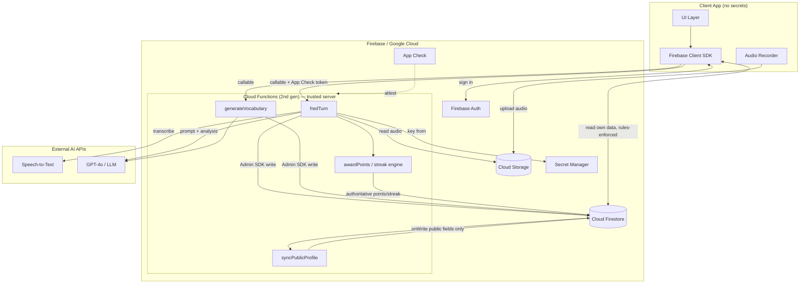

# Architecture Blueprint — Language Learning App (MVP)

> Scope: core functionality, architecture, and security. UI styling/colors are intentionally out of scope.

## 1. Stack

| Layer | Technology | Responsibility |
|-------|-----------|----------------|
| Client | Web (React) or Mobile (Flutter / React Native) | UI, audio capture, optimistic reads. **Holds zero secrets.** |
| Auth | Firebase Authentication | Identity, per-user `uid`, isolates all data. |
| Database | Cloud Firestore | Structured app data (profiles, vocabulary, FRED sessions, social graph). |
| File storage | Cloud Storage for Firebase | Raw audio uploads, avatar images. |
| Server logic | Cloud Functions (2nd gen) | **The only place that talks to paid AI APIs.** Holds API keys, enforces quotas, writes authoritative data (points/streaks). |
| Secrets | Cloud Secret Manager | Stores OpenAI / GPT-4o keys, injected into Functions at runtime. |
| Abuse protection | Firebase App Check | Guarantees calls to Functions come from your genuine app, not a script. |

## 2. High-Level System Diagram



**Key principle:** the client reads its own data directly from Firestore (fast, cheap, rules-enforced), but **every paid AI call and every score-affecting write goes through a Cloud Function**. The client never holds an API key and can never mint its own points.

## 3. FRED — Secure AI Speaking Flow

This answers the architectural questions directly.

### 3.1 How should FRED interact with the database?

FRED never runs on the client. The client only **captures audio** and **calls a function**. A trusted Cloud Function (`fredTurn`) does the AI work and writes results using the Admin SDK (which bypasses security rules — see §4). The client then reads the resulting `fred_sessions` document back through normal, rules-protected reads.

### 3.2 End-to-end sequence

```mermaid
sequenceDiagram
    participant C as Client
    participant CS as Cloud Storage
    participant Fn as fredTurn (Function)
    participant SM as Secret Manager
    participant AI as STT + GPT-4o
    participant FS as Firestore

    C->>CS: upload audio/{uid}/{sessionId}.webm (Storage rules: own folder only)
    C->>Fn: callable fredTurn({sessionId, storagePath}) + Auth + App Check
    Fn->>Fn: verify context.auth + App Check; check quota (usage doc)
    Fn->>CS: download audio
    Fn->>SM: read OPENAI_API_KEY (runtime only)
    Fn->>AI: transcribe -> user_response_text
    Fn->>AI: GPT-4o: analysis_text, performance_score, next prompt
    Fn->>FS: Admin SDK write users/{uid}/fred_sessions/{sessionId}
    Fn->>FS: Admin SDK update usage + award Star Points + streak
    Fn-->>C: { transcript, analysis, score, nextPrompt }
    C->>FS: read fred_sessions (rules: owner read-only)
```

### 3.3 Managing cost & tokens securely

| Risk | Mitigation |
|------|-----------|
| API key leakage | Key lives **only** in Secret Manager, injected into the Function runtime. Never shipped to client, never in Firestore, never in git. |
| Someone scripting your function to burn your budget | **Firebase App Check** (attestation) + `context.auth` required on every callable. Reject unauthenticated/unattested calls before any AI call. |
| A single user running up huge bills | Per-user **quota/rate limit**: `users/{uid}/usage/{yyyy-mm}` doc tracks `sessionCount`, `tokensUsed`, `audioSeconds`. Function refuses once the daily/monthly cap is hit. |
| Oversized prompts / runaway tokens | Server-side caps: trim transcript length, set `max_tokens`, fix the system prompt server-side (client cannot inject arbitrary prompts). |
| Cost blindness | Store `tokensUsed` and `costEstimate` per session; a daily aggregation function + GCP **budget alerts** give visibility. |
| Audio storage cost & privacy | Storage **lifecycle rule** auto-deletes raw audio after processing (e.g. 24h). Keep only the transcript. |

### 3.4 Should we use Firebase Functions to isolate keys?

**Yes — this is non-negotiable.** A client-side app (web or mobile) is fully inspectable; any embedded key is compromised the moment the app ships. Cloud Functions are the standard, correct trust boundary: they authenticate the caller, enforce quotas, hold the secret, call the paid API, and write authoritative results. The same pattern is reused for `generateVocabulary` (feature A).

## 4. Trust Boundary & the Admin SDK

- **Client SDK** → subject to Firestore/Storage **security rules**. Used for the user's own reads and harmless writes (editing their own profile, deleting their own vocabulary).
- **Admin SDK** (inside Functions) → **bypasses rules**, runs with full privilege. Used for everything that must be tamper-proof: writing FRED sessions, awarding Star Points, advancing streaks, unlocking mascot outfits, syncing public profiles.

This split is why the security rules (see `firestore.rules`) make `fred_sessions`, gamification fields, `public_profiles`, and challenge scores **read-only or closed to clients** — the server is the sole author.

## 5. Reference Function Skeleton

See the `functions/` TypeScript project (`functions/src/`) for the implementation of `fredTurn`, `generateVocabulary`, `awardGamePoints`, `syncPublicProfile`, and `deleteMyAccount`, including the App Check + auth + quota guards described above. See `functions/README.md` for setup, secrets, and deploy steps.
