# Every Screen

<div align="center">

</div>

All 33 screens and states of the app, captured from the running client at
460 px width. Regenerate any time with:

```bash
cd app && npm run dev
node scripts/screens.cjs        # writes docs/screens/ + the contact sheet
```

## Contact sheet

[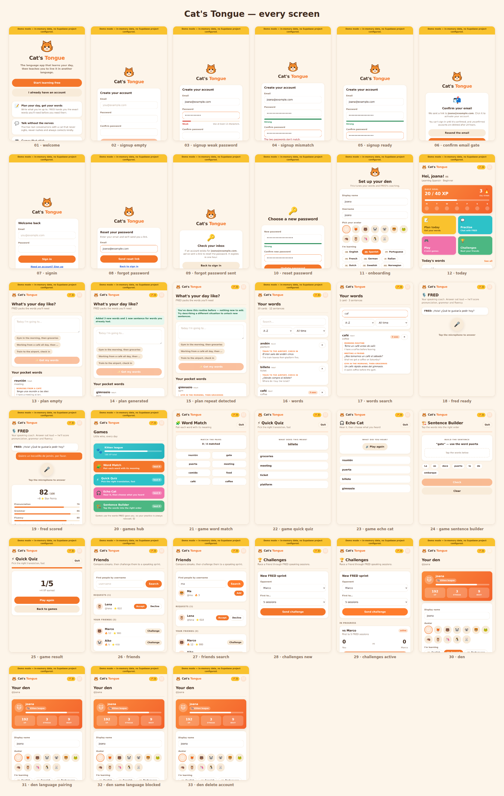](screens/all-screens.png)

---

## 1 · Getting in

| | | |
|---|---|---|
| **01 Welcome**<br>The signed-out landing page: what the app does, then the two ways in.<br> | **02 Sign up**<br>Email, password, and the password again.<br>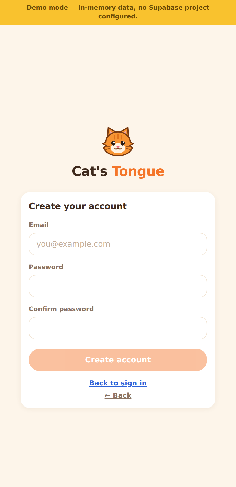 | **03 Weak password**<br>Common passwords are refused, with one thing to fix at a time.<br> |
| **04 Mismatch**<br>The two entries must match before the button unlocks.<br>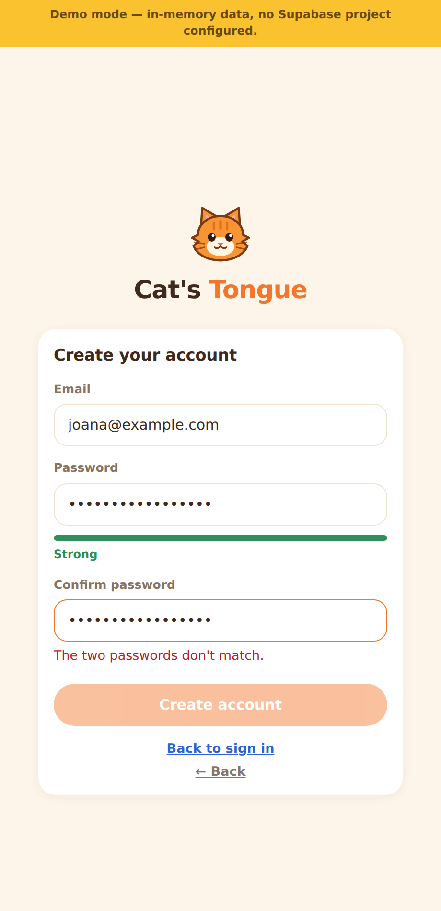 | **05 Ready**<br>Meter turns green and sign-up is enabled.<br> | **06 Confirm your email**<br>No session until it's verified; unconfirmed accounts expire in 24 h.<br> |
| **07 Sign in**<br>One generic failure message, so accounts cannot be enumerated.<br> | **08 Forgot password**<br>Enter the address to receive a link.<br>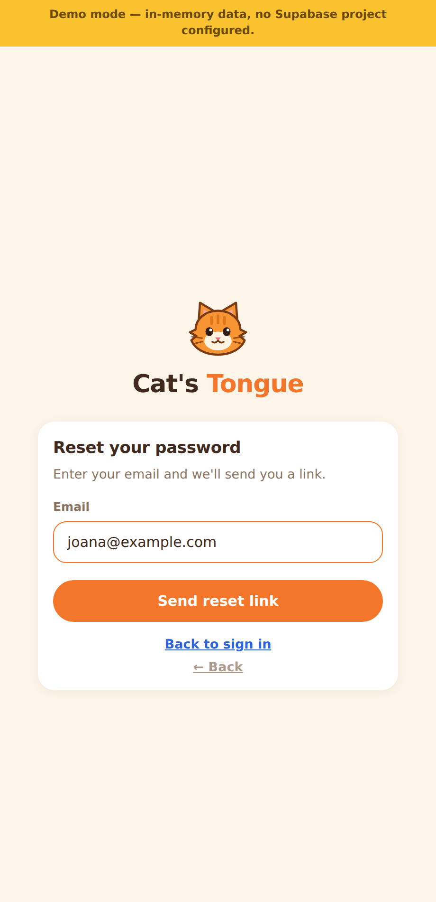 | **09 Link sent**<br>"If an account exists…" — never confirms whether it does.<br>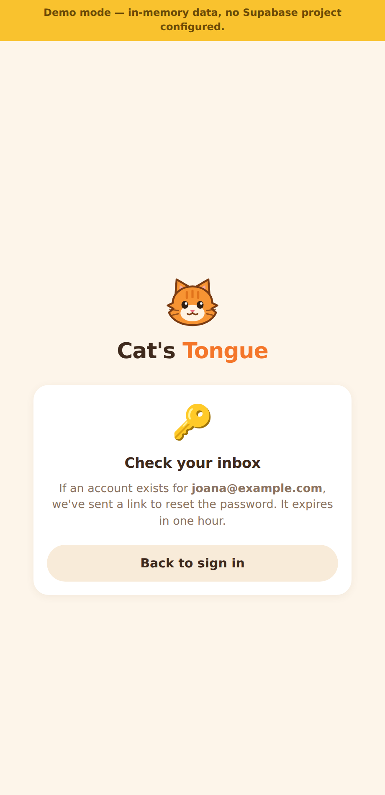 |
| **10 Reset password**<br>Same policy as sign-up; signs you out everywhere afterwards.<br> | **11 Set up your den**<br>Avatar, both languages, and level.<br> | |

## 2 · Daily use

| | | |
|---|---|---|
| **12 Today**<br>Daily XP goal, streak week, four actions, today's words, league.<br> | **13 Plan (empty)**<br>Describe the day ahead in plain language.<br>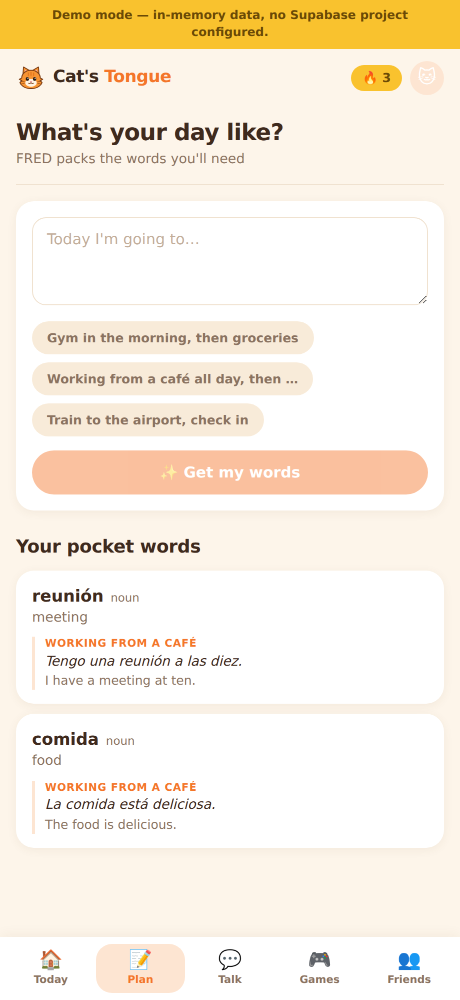 | **14 Plan (generated)**<br>Words packed for that activity, at your level.<br> |
| **15 Repeat detected**<br>The same routine twice adds nothing — and says so.<br> | **16 Your words**<br>One card per word, carrying every context it appeared in.<br> | **17 Search & filter**<br>A–Z or newest first, filtered by date added.<br>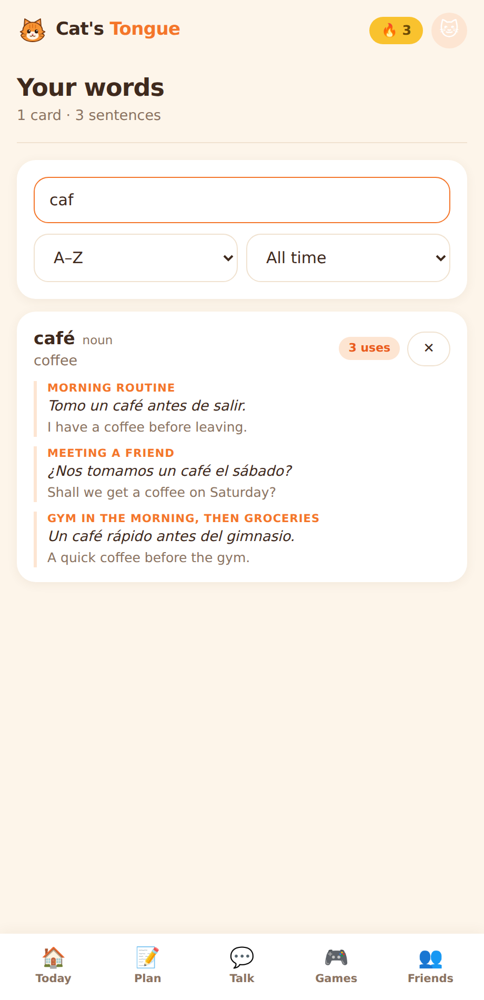 |

## 3 · FRED

| | |
|---|---|
| **18 Ready to speak**<br>FRED asks; you answer out loud.<br>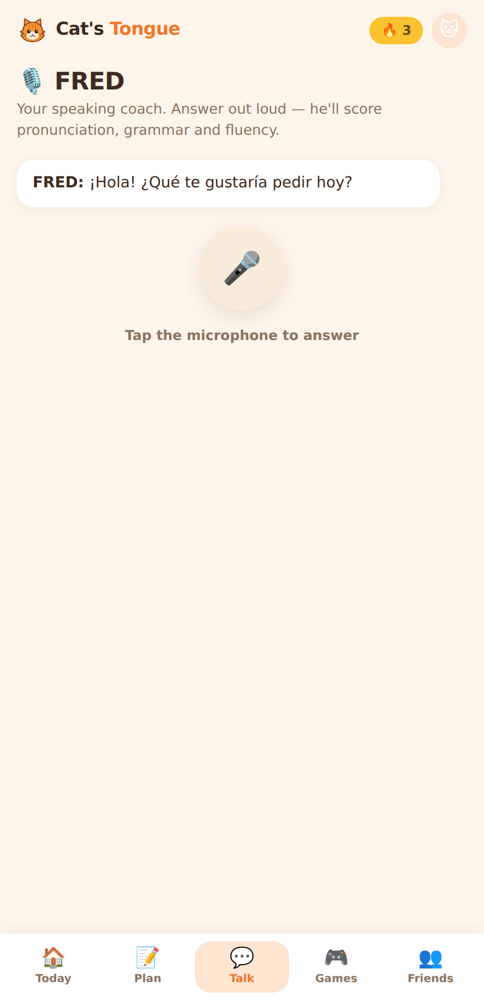 | **19 Scored**<br>Transcript, score, and a breakdown of pronunciation, grammar and fluency.<br> |

## 4 · Games

| | | |
|---|---|---|
| **20 Games hub**<br>Four games, all built from your own vocabulary.<br> | **21 Word Match**<br>Pair each word with its meaning.<br>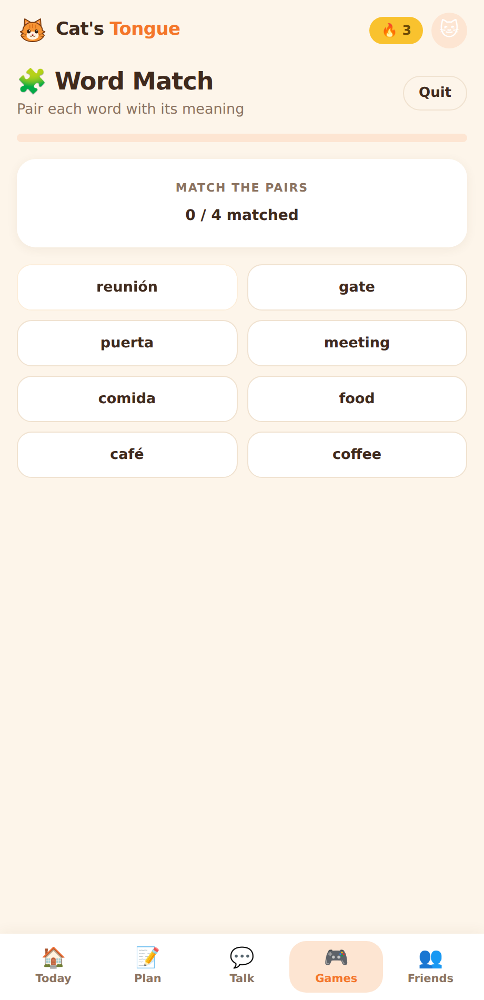 | **22 Quick Quiz**<br>Pick the right translation, fast.<br>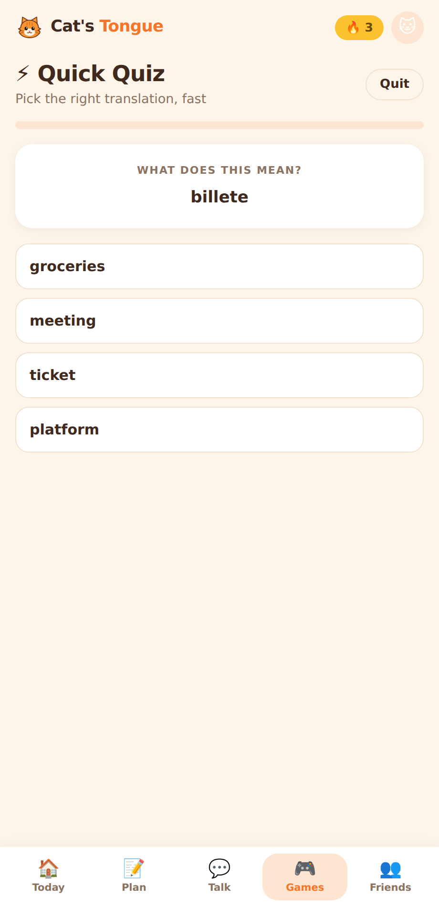 |
| **23 Echo Cat**<br>Hear the word in the language you're learning, then choose it.<br>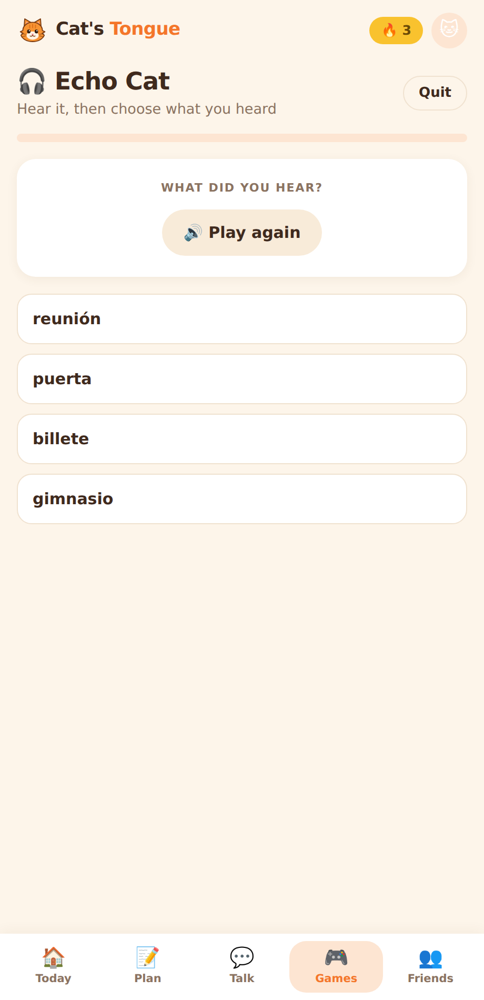 | **24 Sentence Builder**<br>Tap the words into the right order.<br> | **25 Result**<br>Score and XP earned — capped and awarded server-side.<br>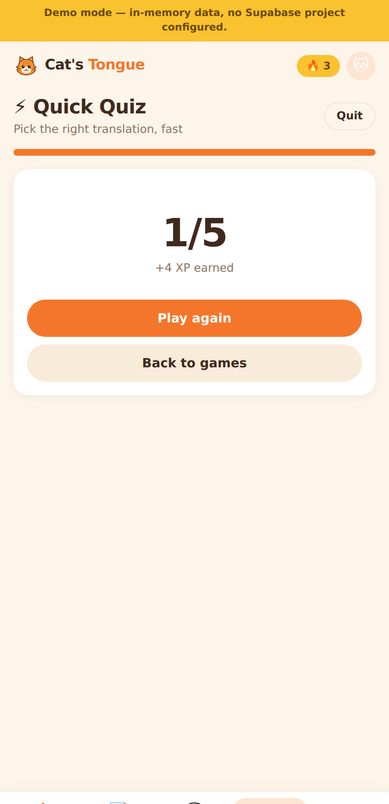 |

## 5 · Social

| | | |
|---|---|---|
| **26 Friends**<br>Requests to answer and friends to compare streaks with.<br> | **27 Search**<br>Find people by username; hidden profiles never appear.<br>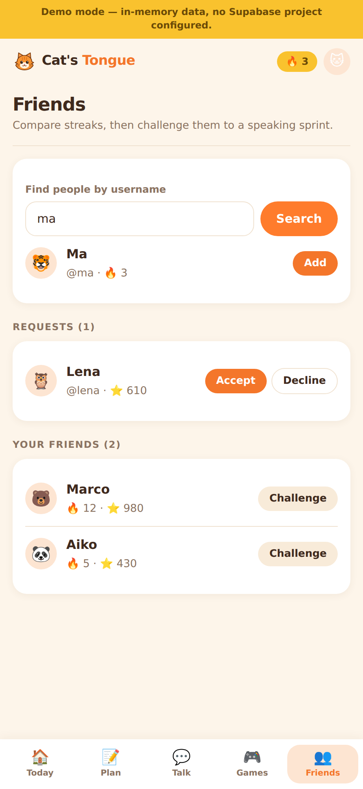 | **28 New challenge**<br>Pick a friend and a target for a FRED sprint.<br>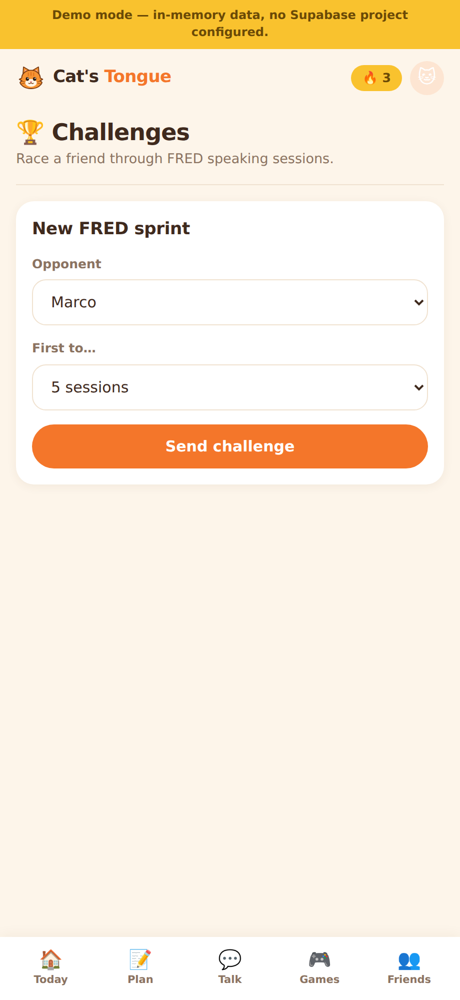 |
| **29 Challenge running**<br>Scores are written by the server from real sessions.<br> | | |

## 6 · Your den

| | | |
|---|---|---|
| **30 Den**<br>Avatar, languages, level, privacy and account actions.<br> | **31 Any language pairing**<br>Portuguese speaker learning French — all 22 pair freely.<br> | **32 Same-language guard**<br>You can't "learn" the language you already speak.<br> |
| **33 Delete account**<br>Type `DELETE` **and** re-enter your password — a stolen session isn't enough.<br>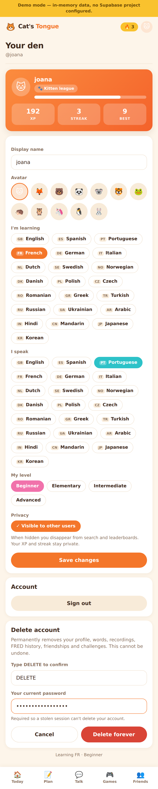 | | |

---

## Navigation

| Tab | Route | Screens |
|-----|-------|---------|
| Today | `/` | 12 |
| Plan | `/plan` | 13–15 |
| Talk | `/talk` | 18–19 |
| Games | `/games`, `/games/:id` | 20–25 |
| Friends | `/friends` | 26–27 |

`/words` (16–17), `/challenges` (28–29) and `/den` (30–33) are reached from the
Today tiles, the "See all" link, and the avatar button in the header. Signed
out, `/` is the welcome page, with `/signup`, `/signin` and `/reset-password`
alongside it.
