# App Screens

Captured from the running React app (`app/`) in demo mode at 460 px width.
Warm cream + orange theme, five-tab navigation, customisable avatars.

### Account lifecycle

| | |
|---|---|
| **Sign-up validation**<br>Weak password blocked, with one fix at a time.<br>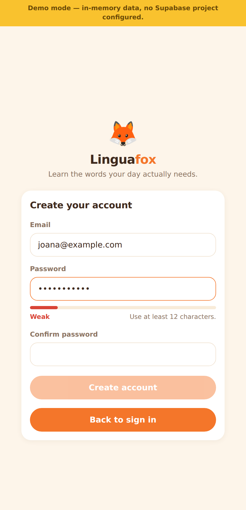 | **Confirm password**<br>Mismatch blocks submission.<br>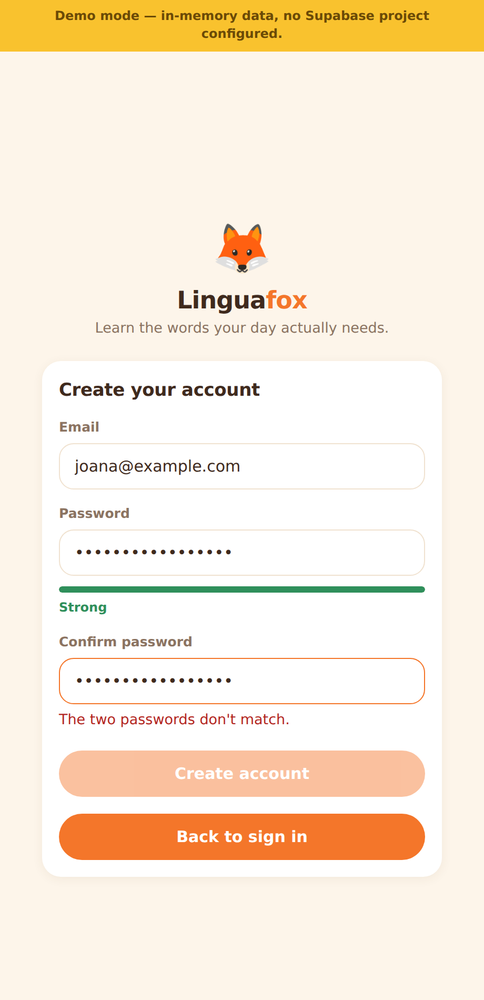 |
| **Strong password accepted**<br>Meter turns green and submit unlocks.<br>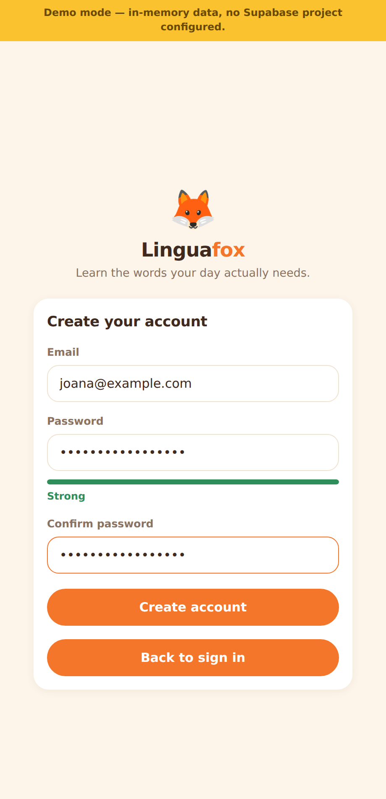 | **Confirmation gate**<br>No session until the email is verified; 24-hour expiry stated.<br>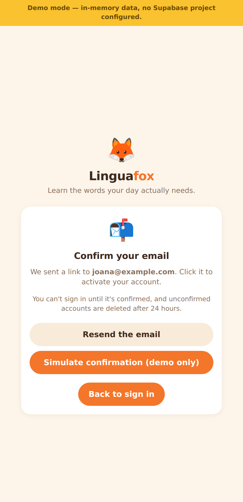 |
| **Forgot password**<br>Neutral wording — never reveals whether an account exists.<br>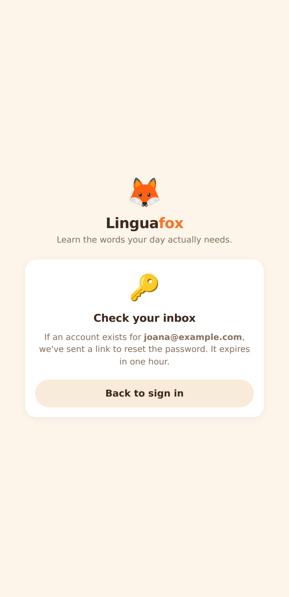 | **Reset password**<br>Same policy as sign-up, typed twice.<br>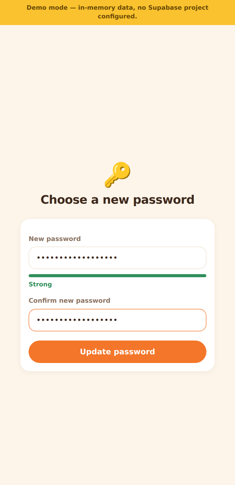 |

### The app

| | |
|---|---|
| **1. Sign in**<br>Generic failure message so accounts cannot be enumerated.<br>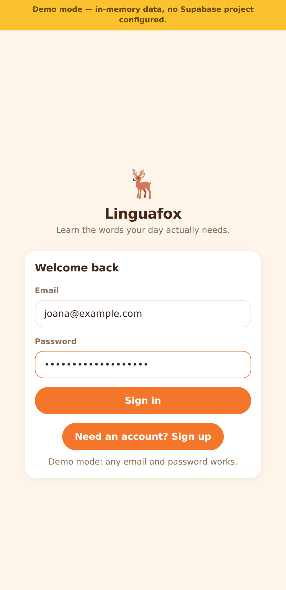 | **2. Set up your den**<br>Avatar picker, language chips, and plain-English levels.<br> |
| **3. Today**<br>Daily XP goal, week strip, four action tiles, today's words, league.<br>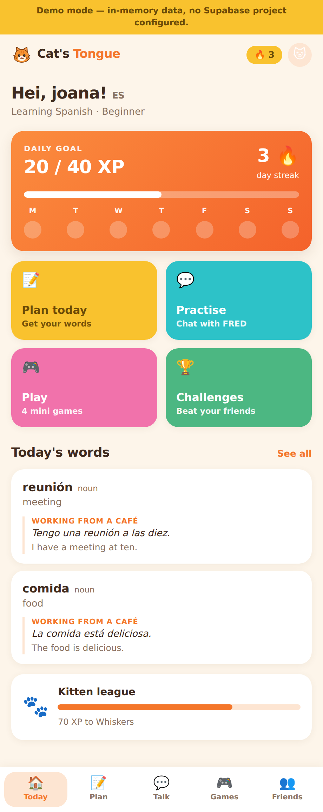 | **4. Plan**<br>Describe your day → FRED packs the words you'll need.<br>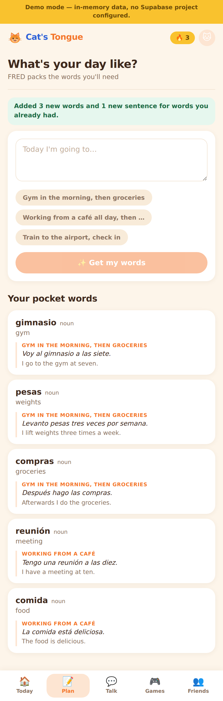 |
| **5. Repeated routine**<br>Same day described twice adds nothing — and says so.<br> | **6. Your words**<br>One card per word; "café" carries 3 contexts, not 3 duplicates.<br>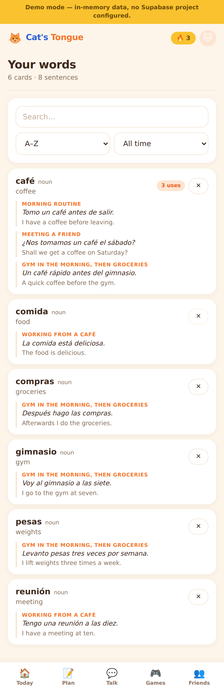 |
| **7. Talk — FRED**<br>Unchanged speaking coach: record, transcribe, score.<br>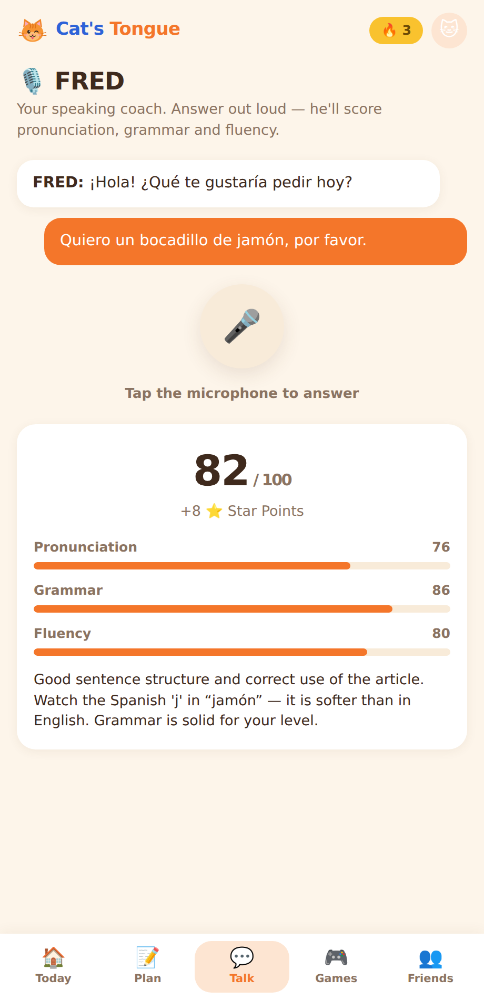 | **8. Games**<br>Four mini-games built from the learner's own vocabulary.<br>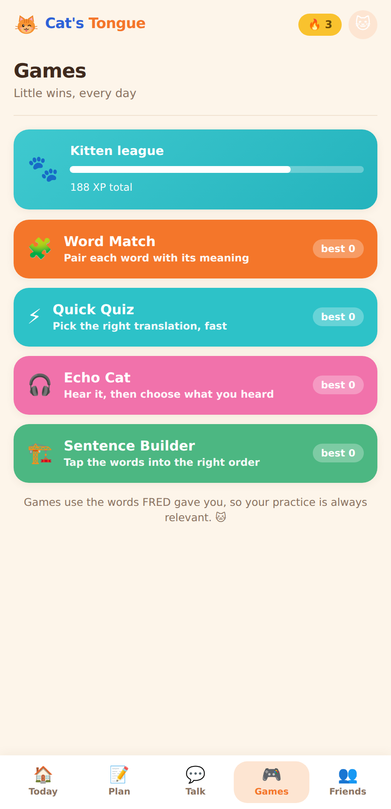 |
| **9. Sentence Builder**<br>Tap the words into the right order.<br>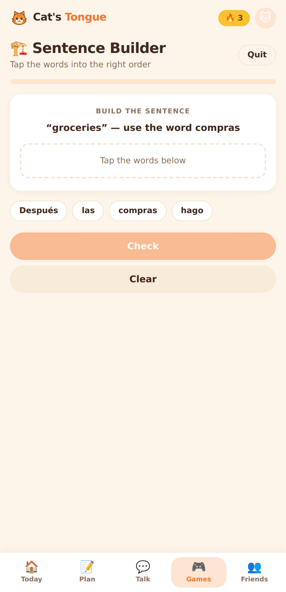 | **10. Friends**<br>Search by username, accept requests, compare streaks.<br>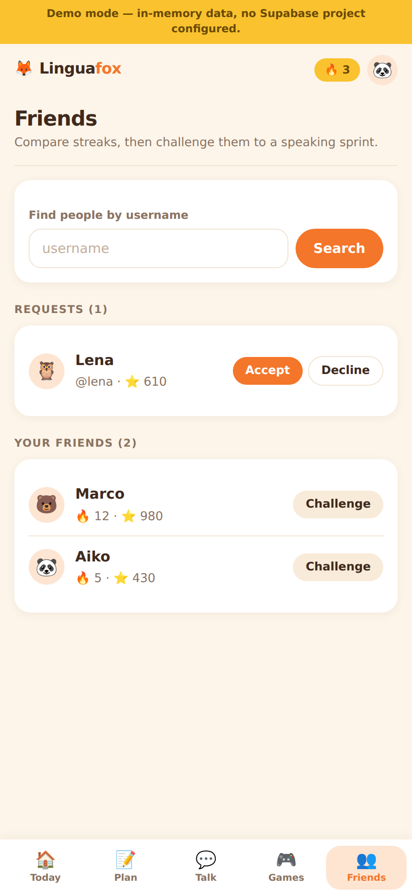 |
| **11. Challenges**<br>FRED sprints against a friend, scored server-side.<br>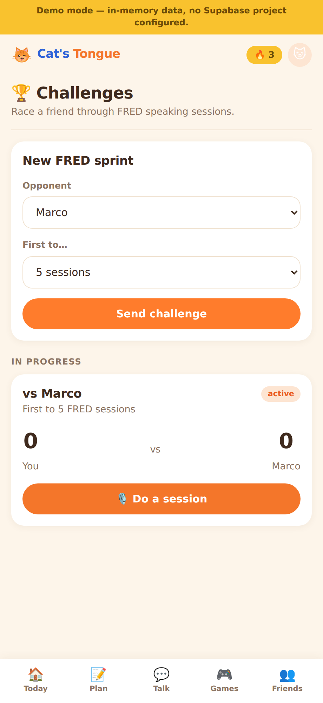 | **12. Your den**<br>Avatar, languages, level, privacy — and account deletion.<br>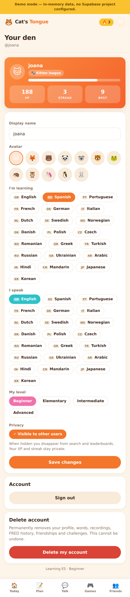 |
| **13. Delete account**<br>Type-to-confirm before permanent erasure.<br>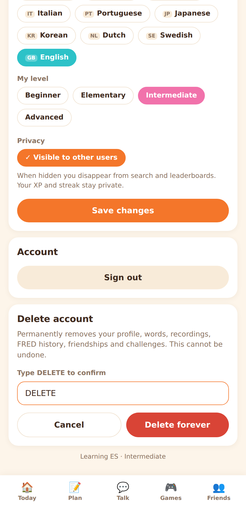 | |

## Navigation

Five tabs, matching the reference design:

| Tab | Route | Purpose |
|-----|-------|---------|
| Today | `/` | Dashboard: goal, streak, tiles, today's words |
| Plan | `/plan` | Describe your day, get vocabulary |
| Talk | `/talk` | FRED, the speaking coach |
| Games | `/games` | Word Match · Quick Quiz · Echo Fox · Sentence Builder |
| Friends | `/friends` | Social graph and leaderboard |

`/words`, `/challenges` and `/den` are reached from the Today tiles, the
"See all" link, and the avatar button in the header.

## Flow

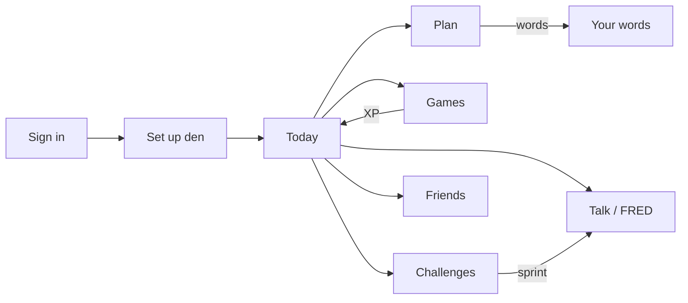

## Reproducing these

```bash
cd app && npm install && npm run dev
```

With no `.env` the app runs in demo mode against an in-memory store, so every
screen is reachable without a Supabase project.
