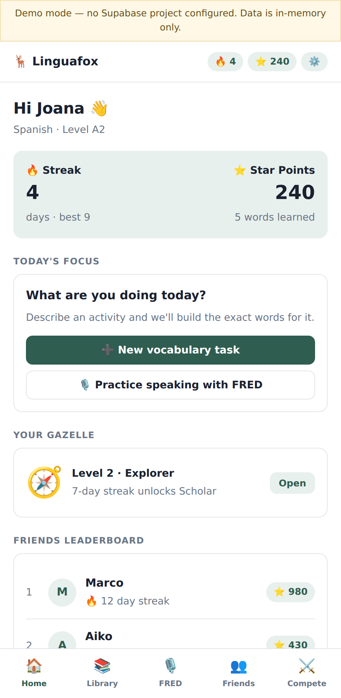
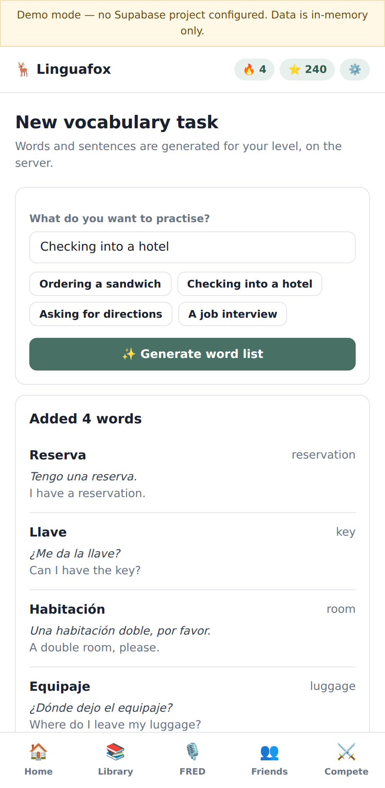
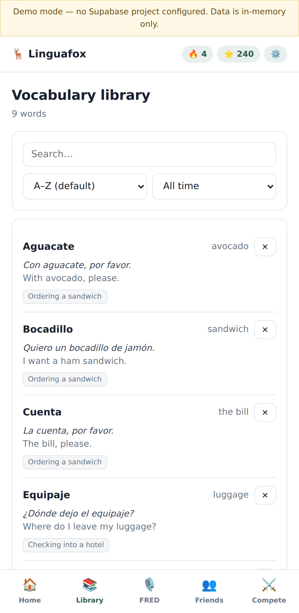
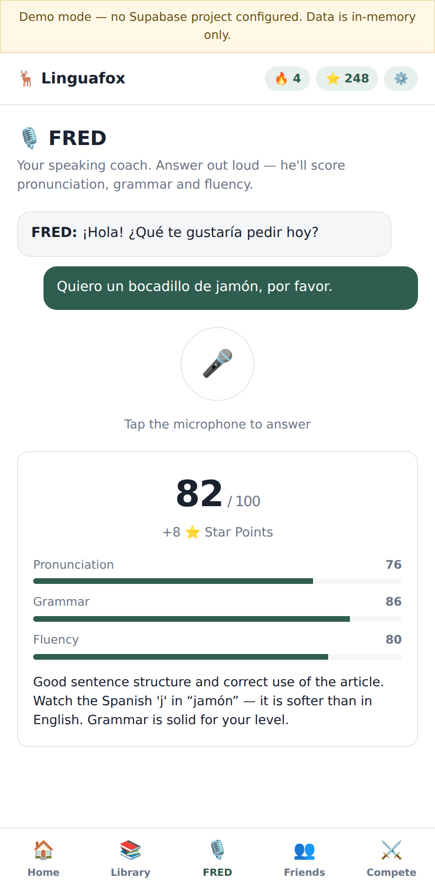
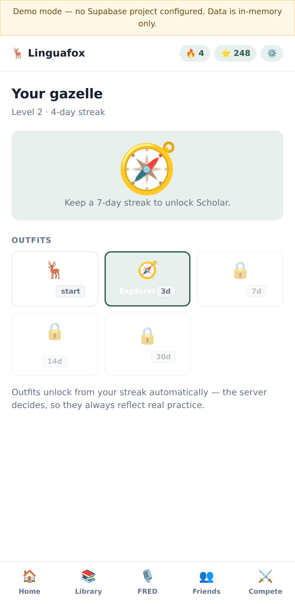
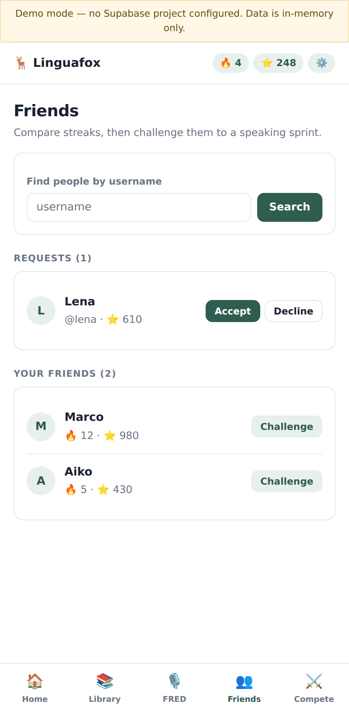
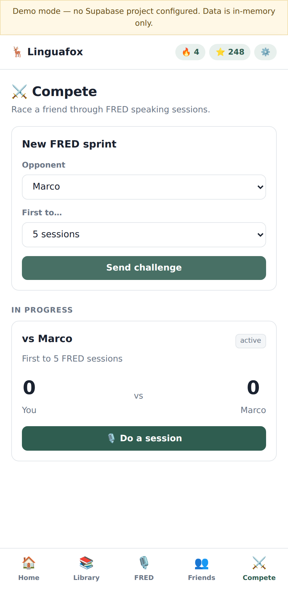
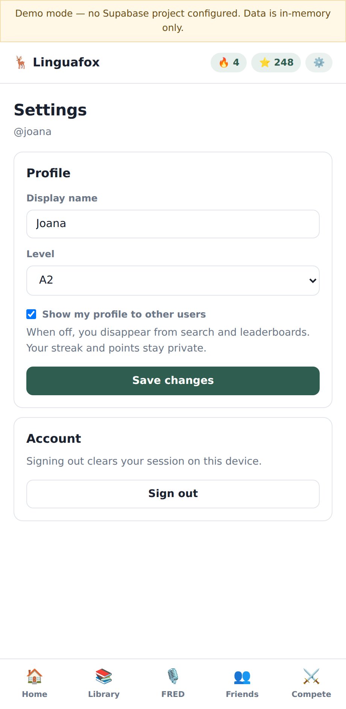
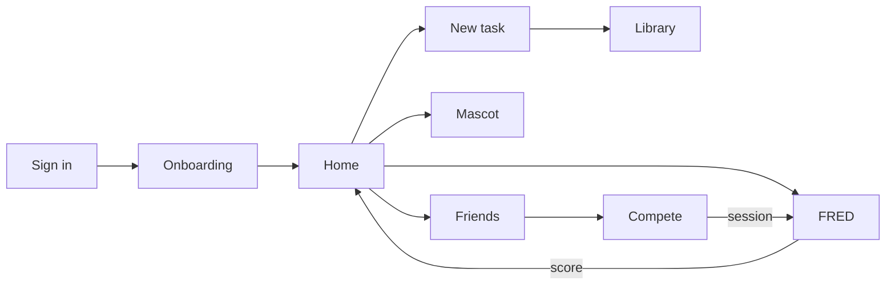

# App Screens

Captured from the running React app (`app/`) in demo mode, at a 460 px mobile
width. Styling is intentionally restrained for this phase — the focus is
structure, flow and security.

| | |
|---|---|
| **1. Sign in / Sign up**<br>Generic failure message so accounts cannot be enumerated.<br> | **2. Onboarding**<br>Username, languages and CEFR level — these drive AI difficulty.<br> |
| **3. Home**<br>Streak, Star Points, today's actions, mascot and friends leaderboard.<br> | **4. Vocabulary task**<br>Describe an activity; the server generates level-appropriate words.<br> |
| **5. Library**<br>Alphabetical by default; sort by date added, filter by range, search.<br> | **6. FRED**<br>Record, transcribe, score. Breakdown across pronunciation, grammar, fluency.<br> |
| **7. Gazelle mascot**<br>Outfits unlock from streak thresholds, validated server-side.<br> | **8. Friends**<br>Search by username, accept requests, see friends' public stats.<br> |
| **9. Compete**<br>FRED sprint against a friend; scores are written by the server.<br> | **10. Settings**<br>Profile, level, and the privacy toggle that hides you from search.<br> |

## Flow



## Reproducing these

```bash
cd app && npm install && npm run dev
```

With no `.env` present the app starts in **demo mode** against an in-memory
store, so every screen is reachable without a Supabase project. Add
`VITE_SUPABASE_URL` and `VITE_SUPABASE_ANON_KEY` to run against the real
backend.
